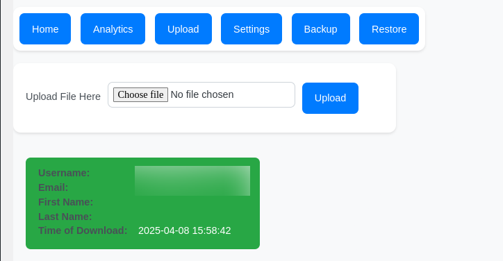

[](https://intermediakt.org)
[](https://www.php.net/downloads.php)
[](https://wordpress.org/download/releases/6-7/)


## Author
Created by [Charalambos Rentoumis](https://github.com/5skr0ll3r)

## Overview
The **IMKT DsMedia Plugin** is a WordPress plugin that bypasses the cart and checkout processes for digital downloadables and signs each downloaded file with a unique identifier so you can trace the leak back to a user, it provides basic metrics for the downloaded products and has a backup and restore from backup functinalities. Supports download from cdn with or without cookie authentication and products uploaded directly to wordpress.

## Why
This plugin was created with the intent of not having to deal with the whole cart and checkout process of woocommerce for free digital downloadable products .

Here you will find a code snippet with some explanetion on how to acheive that without using the whole plugin with a ready to go example [Bypass Woo(s) cart and checkout](Bypass-Checkout-process-of-WooCommerce.md).

## Accessibility features
- Removes cart and checkout processes from woocommerce, making it more accessable to people with visibility conditions, since its easier to just directly download the file you want without having to navigate to other pages filling forms.
....

## Screenshots 


Home contains information about the plugin and its functionality.


Analytics contain information about the unique (doesnt count if user redownloaded the file) 
downloads each product has and an overall downloads count.


Upload is used to trace a leak by uploading a file that was downloaded from the website .


The Settings tab contains textfields for the signature that will be signed to the files also you can add custom header for remote file access if it requires authentication and finaly a drop all tables option .


You can create backup of the table containing the info from the downloads in either a json or a sql format.


You can restore the downloads table by uploading a valid backup that is either in json or sql format.


The download button is rendered under the product image in a single product page with a select element which provides all the available files for the product.

## ContactUs
For more information/feedback etc. contact us in
techsupport@intermediakt.org
charalambos@intermediakt.org 

# Docs

## File Structure
```
.
└── dsmedia/
    ├── index.php
    ├── dsmedia_plugin.php
    ├── Documentation.md
    ├── Bypass-Checkout-process-of-WooCommerce.md
    ├── includes/
    │   ├── index.php
    │   ├── dsmedia_plugin_activate.php
    │   ├── dsmedia_plugin_db_api.php
    │   ├── dsmedia_plugin_deactivate.php
    │   └── dsmedia_plugin_download_handler.php
    ├── templates/
    │   ├── admin/
    │   │   ├── index.php
    │   │   └── admin_panel.php
    │   ├── index.php
    │   └── display_downloads.php
    └── utils/
        ├── index.php
        └── dsmedia_utils.php
```

## Plugin Metadata
- **Plugin Name**: DsMedia Plugin
- **Description**: Bypasses woo(s) cart and checkout proccesses for free digital downloadable products.
- **Version**: 1.0.0
- **Author**: Charalambos Rentoumis
- **WP Requires At Least**: 6.0
- **WP Tested Up To**: 6.7
- **WC Requires At Least**: 6.0
- **WC Tested Up To**: 9.7.1
- **License**: Attribution-ShareAlike 4.0 International
- **License URI**: [Attribution-ShareAlike 4.0 International](https://creativecommons.org/licenses/by-sa/4.0/)

## Global Variables
- `PLUGIN_DIR_PATH`: **String** – Full path to the plugin directory.

## Key Hooks
- `register_activation_hook`: Registers the plugins activation function.
- `register_deactivation_hook`: Registers the plugins deactivation function.
- `add_action('init')`: Initializes the plugin.
- `add_action('admin_menu')`: Adds a custom menu item in the admin dashboard.
- `add_action('woocommerce_simple_add_to_cart')`: Adds a custom download button on the single product page under the product image.

## Entry File: `dsmedia_plugin.php`

---

## Class: DsMedia_Plugin (dsmedia_plugin.php)
- **Description**: This class is the entry of the plugin, everything is setup and registered from this class.


### Method:

#### **Public Static** `__construct()`
- **Description**: The constructor of the class registers the admin page to the admin menu and hooks the download button to be displayed under the single product image.

#### **Public Static** `activate()`
- **Description**: Calls the `DsMedia_Plugin_Activate::activate()` on activation.

#### **Public Static** `deactivate()`
- **Description**: Calls the `DsMedia_Plugin_Deactivate::deactivate()` on deactivation.

#### **Public Static** `add_menu_item()`
- **Description**: This method gets hooked by the `__construct()` method to the `admin_menu` hook and it calls the `add_menu_page()` to register the plugins admin panel provided by the method of this class `render_settings()`.

#### **Public Static** `render_settings()`
- **Description**: Includes the admin panel file to be rendered 

#### **Public Static** `display_downloads_on_single_product_page()`
- **Description**: THis method gets hooke to `woocommerce_simple_add_to_cart` by the `_construct()` method to display the download button under the image in the single product page

---


## Class: DsMedia_Plugin_Activate (dsmedia_plugin_activate.php)
- **Description**: On activation the activate method of this class set's up the database ass needed if it is not already set up.


### Methods:

#### **Public Static** `activate()`
- **Description**: On activation this method attempts to create the database table used by the plugin if it doesnt already exist.

---


## Class: DsMedia_Plugin_Deactivate (dsmedia_plugin_deactivate.php)
- **Description**: This class is used either for cleanup or just deactivation of the plugin.


### Methods:

#### **Public Static** `deactivate()`
- **Description**: If the option ( You can find it in dsmedia admin panel in settings ) `to_drop_or_not` is set to on, on deactivation it attempts to clean the site from any content providided by the plugin.

---


## Class:  DsMedia_Plugin_DB_API (dsmedia_plugin_db_api.php)
- **Description**: Used for any communication with the database .

### Properties:
- **Static `$plugins_tables_prefix`**: **String** - The prefix defined by the plugin for the it's database tables ( 'dsm_' ).
- **Static `wp_tables_prefix`**: **String** - The prefix defined by the site owner for all wordpress database tables ( 'wp_' ).
- **Static `$database_table_name`**: **String** - The full name of the database table ( 'wp_dsm_table_name' ).
- **Static `$queries`**: **Array** - Contains all queries for any interaction with the database.


### Methods:

#### **Public Static**: `init()`
- **Description**: Initializes the table prefixes, table name and the $queries array. Variables and methods are static so they are accessible whenever without having to create instances, therefor since the variables are static and we don't know the `$wpdb->wp_prefix;` before hand i initialize them this way.

#### **Public Static**: `create_table(): bool`
- **Description**: When activating the plugin, the create_table() is called and it attempts to create the plugins table if it doesnt already exist.

#### **Public Static** `drop_table(): bool`
- **Description**: If the option ( You can find it in dsmedia admin panel in settings ) `to_drop_or_not` is set to on, on deactivation this method will attempt to drop the plugins table.

#### **Public Static** `insert( $insert_arguments ): array`
- **Description**: This method creates a new entry in the database with information about who and what downloaded and returns the insert_id to be used in the key that will sign the book being downloaded,
- **Arguments**:
	- array(
		- `[ 'user_id' ]` => **Integer**,
		- `[ 'product_id' ]` => **Integer**
	- )
- **Returns**: the array contains two keys the `data` which contains the `insert_id` and status which shows if the query was successful or not.
	- array(
		- `[ 'data' ]` => **Integer**,
		- `[ 'status' ]` => **Bool**
	- )

#### **Public Static** `get_all(): array | bool`
- **Description**: This method returns all available data stored in the table

#### **Public Static** `get_by_id( $id ): array | bool`
- **Description**: This method returns an entry from the table by id
- **Arguments**:
	- `$id`: `Integer`

#### **Public Static** `count_single_downloads(): array | bool`
- **Description**: Used for the metrics, uses a query that returns the total downloads count but also every unique_download ( if the user downloaded a book 2 times or more only one will count ).
- **Returns**: 
	- array(
		- `[ 'product_id' ]` => **Integer**,
		- `[ 'post_title' ]` => **String**,
		- `[ 'unique_downloads' ]` => **Integer**,
		- `[ 'total_downloads' ]` => **Integer**
	- )

#### **Public Static** `create_backup( $mode ): string | bool`
- **Description**: Depending on the mode this method will create a backup of the plugins table either in a .sql or .json file.
- **Arguments**:
	- `$mode`: **Integer** // 0 === sql else json
- **Returns**
	- returns a string containing the path of the backup that was generated.
	- `"Backup saved to: " . $backup_file`

#### **Public Static** `restore_from_backup( $backup_file, $mode ): bool`
- **Description**: Restores the plugins table from a backup
- **Arguments**:
	- `$backup_file`: **String** // path to file
	- `$mode`: **Integer** // 0 === sql else json

---


## Class:  DsMedia_Plugin_Download_Handler (dsmedia_plugin_download_handler.php)
- **Description**: This class is used to create the signatures signed to the audio files the report of download events and the download it self.

### Properties:
- **Static `$signature_length`**: **Integer** - The length of the signature that is appended to the end of the downloadables.


### Methods:

#### **Public Static**: `report(): array`
- **Description**: `report` utilises the `insert` method of `DsMedia_Plugin_DB_API` to create a new entry in the table.
- **Arguments**:
	- array(
		- `[ 'user_id' ]` => **Integer**,
		- `[ 'product_id' ]` => **Integer**
	- )
- **Returns**: the array contains two keys the `data` which contains the `insert_id` and status which shows if the query was successful or not.
	- array(
		- `[ 'data' ]` => **Integer**,
		- `[ 'status' ]` => **Bool**
	- )

#### **Public Static** `format_signature( $signature ): string`
- **Description**: Takes the signature string, encodes it in base64 and fills out the length by adding ( * ).
- **Arguments**:
	- `$signature`: **String**
- **Returns**: 
	- `$signature`: **String**

#### **Public Static** `generate_download_signature( $product_id ): string`
- **Description**:	This method will generate a signature depending on if the downloaded event was succesfully reported to the database. the signature consists of two parts seperated by `:`, the first part being the type and the second the id, if the report completes the signature will take the following form `AthenaLibraryDownloadId:<entry_id>` and if not it will take this form `AthenaLibraryUserId:<user_id>`.
- **Arguments**:
	- `$product_id`: **Integer**

#### **Public Static** `stream_file_from_cdn( $url, $file_name, $product_id ): bool`
- **Description**: This method handles both retrive from cdn and also download to the user.
- **Arguments**:
	- `$url`: **String**
	- `$filename`: **String**
	- `$product_id`: **Integer**


## Templates:

### Downloads Button (display_downloads.php)

- **Description**: This template contains the code that will be rendered in the product page if the user is `logged_in()`, it will display a button and a select html element under the product image, with the __\<select\>__ containing all the names from available downloads set for the product from woocommerce's edit interface and after the user selects and presses the button the download is going to be forced to the users browser

### Admin Panel (admin/admin_panel.php)

- **Description**: The panel contains the following features:
	- Handles Menu Selection – Saves and loads the selected menu option for the user. 
	- Processes File Uploads – Processes uploaded files, checking for a specific signature.
	- Extracts User Data – If a signature is found, it retrieves and displays user details related to the file.
	- Handles Backup Creation – Allows users to create a backup of plugin-related data either in a `.sql` file or a `.json`.
	- Restores Backups – Accepts `.sql` or `.json` files to restore previous backups.
	- Handles Plugin Deactivation Settings – Offers an option to delete database tables when the plugin is deactivated.
